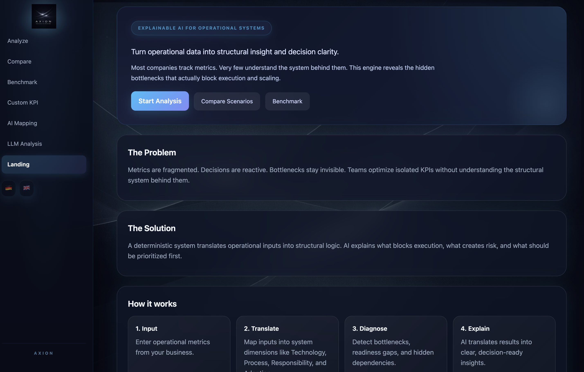
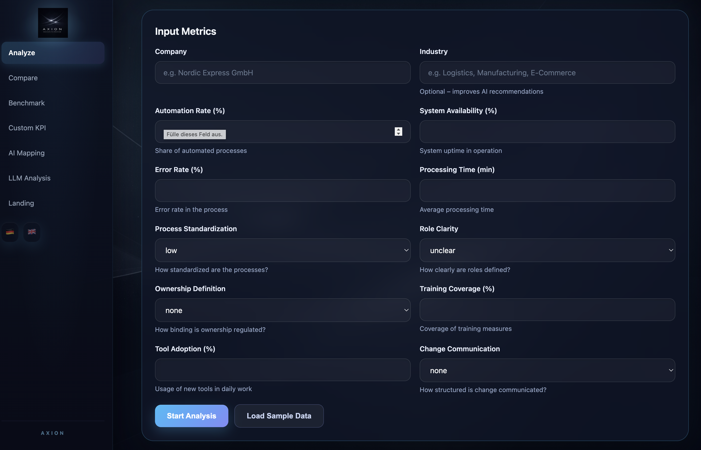
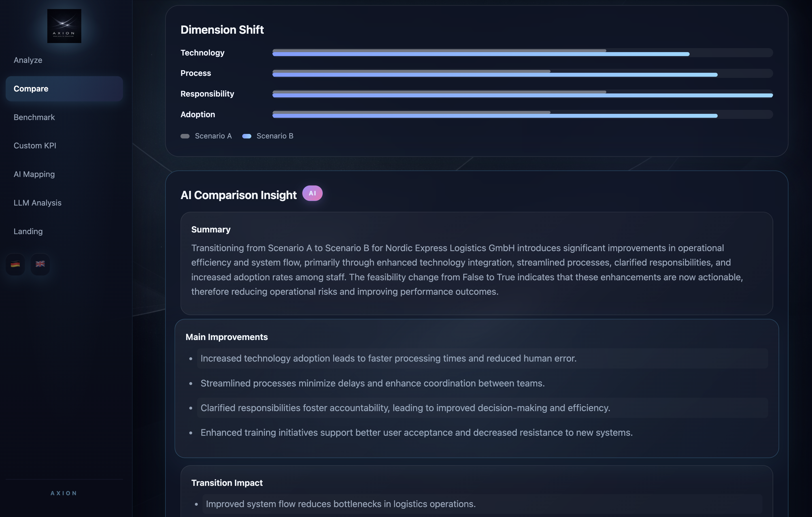

# AXION — Explainable AI-supported Decision Engine


AXION is an explainable AI-supported decision engine designed to analyse operational systems through deterministic scoring models, KPI mapping and AI-generated insights.

The system combines backend architecture, operational analytics and AI-supported decision support to identify structural bottlenecks, evaluate organisational readiness and improve transparency in complex operational environments.

## Application Preview

### Landing Page



### Analysis Dashboard



### Scenario Comparison



## Tech Stack
- **Backend**: Flask (Python)
- **Database**: SQLite with SQLAlchemy ORM
- **Frontend**: HTML/CSS/JavaScript with Jinja2 templates
- **AI Integration**: OpenAI API (optional, for LLM explanations)
- **Validation**: Pydantic models

## Architecture Overview

The application follows a modular backend architecture separating routing, business logic, validation, retrieval and AI integration layers.

Core functionality is divided into:

- Flask-based application and routing layer
- Deterministic scoring and KPI mapping engine 
- AI-supported explanation and retrieval components 
- Modular frontend templates using Jinja2 
- SQLite-based persistence layer

## Project Structure

```
AI Explainable Decision Engine/
├── app/
│   ├── __init__.py          # Flask app initialization
│   ├── routes.py            # All API routes and page handlers
│   ├── static/
│   │   ├── style.css        # Main stylesheet
│   │   └── images/          # Static images (logo, backgrounds)
│   └── templates/           # Jinja2 HTML templates
│       ├── base.html        # Base template with sidebar navigation
│       ├── index.html       # Main analysis page (/)
│       ├── compare_demo.html # Scenario comparison (/compare-demo)
│       ├── benchmark_demo.html # Industry benchmarking (/benchmark-demo)
│       ├── custom_kpi_demo.html # Custom KPI mapping (/custom-kpi-demo)
│       ├── ai_mapping_demo.html # AI KPI dimension suggestion (/ai-mapping-demo)
│       ├── temperature_demo.html # LLM temperature comparison (/temperature-demo)
│       ├── chat.html         # Context-aware chat interface (/chat)
│       └── landing.html      # Landing page (/landing)
├── core/
│   ├── __init__.py
│   ├── engine.py            # Deterministic scoring engine
│   ├── mapping.py           # Metrics to indicators mapping
│   ├── custom_mapping.py     # Custom KPI scoring
│   ├── retrieval.py          # RAG context retrieval
│   ├── llm.py                # OpenAI integration
│   └── validation.py         # Output validation
├── data/
│   ├── assessments.db        # SQLite database
│   └── industry_benchmarks.json # Industry benchmark data
├── requirements.txt
├── run.py                   # Application entry point
└── README.md
```

## Features

### 1. Main Analysis (/)
- Input company metrics (automation rate, system availability, error rates, etc.)
- Automatic metric-to-indicator mapping
- Deterministic engine scoring (0-3 scale per dimension)
- Structural bottleneck identification
- AI-powered explanations (when OpenAI API key is set)

### 2. Custom KPI Mapping (/custom-kpi-demo)
- Define custom KPIs with thresholds
- Map KPIs to four structural dimensions:
  - **T** (Technology): System support, uptime, integration, automation
  - **P** (Process): Execution speed, error rates, throughput, delays
  - **R** (Responsibility): Ownership, accountability, handovers
  - **A** (Adoption): Training, usage, change communication, engagement
- Transfer custom KPIs to main analysis

### 3. AI KPI Mapping (/ai-mapping-demo)
- Enter a KPI name
- AI suggests the most likely structural dimension
- Add suggested KPIs to Custom KPIs for further configuration

### 4. Scenario Comparison (/compare-demo)
- Compare current state vs. target state
- See how structural bottlenecks shift with changes
- Load sample data for testing

### 5. LLM Temperature Comparison (/temperature-demo)
- Compare two AI response styles (temperature 0.2 vs 0.8)
- Analyze company data with both styles
- See differences in recommendations

### 6. Industry Benchmarking (/benchmark-demo)
- Compare company metrics against industry averages
- Visual performance comparison

### 7. Context-Aware Chat (/chat)
- Ask follow-up questions about your analysis
- Chat uses your latest analysis results for context

## Setup

```bash
# Create virtual environment
python -m venv .venv
source .venv/bin/activate  # On Windows: .venv\Scripts\activate

# Install dependencies
pip install -r requirements.txt

# Set OpenAI API key (optional, for AI explanations)
export OPENAI_API_KEY="your-api-key-here"

# Run the application
python run.py
```

The application runs on http://localhost:5000 by default.

## Language Support

The application supports both German (de) and English (en). Language can be switched via:
- Sidebar language buttons
- URL parameter: `?lang=de` or `?lang=en`

## Key Concepts

### Dimensions (4 Structural Areas)
1. **Technology (T)**: Infrastructure, systems, automation level
2. **Process (P)**: Execution quality, standardization, efficiency
3. **Responsibility (R)**: Ownership clarity, escalation paths, accountability
4. **Adoption (A)**: User acceptance, training, change management

### Scoring System
- Each dimension scored 0-3:
  - 3 = Excellent (above threshold)
  - 2 = Good (meets standard)
  - 1 = Acceptable (minimum requirements)
  - 0 = Critical (below minimum)

### Readiness Calculation
- Overall readiness = average of all dimension scores
- Transition feasibility based on current vs. target scores
- Risk assessment based on gap analysis

## API Endpoints (Internal)

| Endpoint | Method | Description |
|----------|--------|-------------|
| `/` | GET | Main analysis page |
| `/compare-demo` | GET/POST | Scenario comparison |
| `/benchmark-demo` | GET/POST | Industry benchmarking |
| `/custom-kpi-demo` | GET/POST | Custom KPI mapping |
| `/ai-mapping-demo` | GET/POST | AI dimension suggestion |
| `/temperature-demo` | GET | LLM temperature comparison |
| `/chat` | GET/POST | Context-aware chat |
| `/assessments/analyze` | POST | Run analysis (API) |
| `/explanations/analyze-company` | POST | LLM explanation (API) |

## Environment Variables

| Variable | Required | Description |
|----------|----------|-------------|
| `OPENAI_API_KEY` | No | OpenAI API key for AI explanations |
| `FLASK_ENV` | No | `development` or `production` |

## Development

The application uses:
- Flask's built-in development server for testing
- Session-based storage for chat history and analysis results
- Client-side sessionStorage for custom KPI data

## Current Status

Core system architecture and key functionality implemented, including deterministic scoring logic, AI-supported explanations, KPI mapping, benchmarking and scenario comparison.
